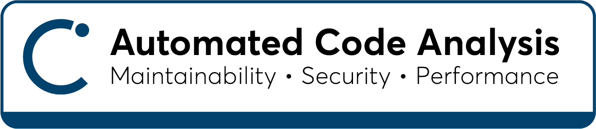
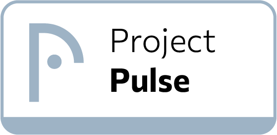
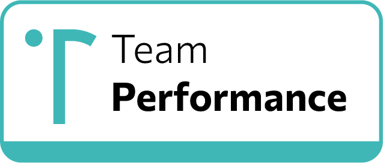

<p align="center">
  
</p>

<h1 align="center">Welcome to Cyclopt Panorama 👋 </h1>

A web application interface for the **Panorama** of every team lead. 

## 🧩 Features  


- <p>
  
  <br/>
  <b>Data-driven quality evaluation</b><br/>
  <span>
    Based on ISO 25010:2023, we apply a hierarchical quality evaluation methodology that relies on software metrics calculated against source code properties. Complexity, coupling, cohesion, level of proper documentation, are only some of the properties we calculate at function, class and package level.
    <br>
    Analyzing a massive, ever-changing benchmark dataset by employing AI-driven and ML-based techniques, we are able to identify the proper ranges for properties the suitable formulas to evaluate maintainability, security and their sub-characteristics.
  </span>
</p>

- <p>
    
    <br/>
    <b>Actionable recommendations when you need them</b><br/>
    <span>
    Your heads-up display when running a software team. Get a clear picture on how your software projects are going. Identify pain points, take action fast, avoid risks building up.<br>
    Set up your own notification plan, tailored to the specifics of your projects and your team. So that information is relevant to your needs and not generic mumbo-jumbo.
    </span>
</p>

- <p>
    
    <br/>
    <b>Work breakdown made easy</b><br/>
    <span> 
    Easily manage work across projects and teams. Get productivity analytics and performance alerts for your team, working on the various stages of software development pipeline.
    </span>
    <br/>
    <b>Know your team</b>
    <br/>
    <span>
    Have a single point of reference for getting a full overview of the workload delegation of all your team members. Quantifiable analytics and drill-down knowledge on who works on what enables you to get the best of everyone in the team, handle possible delays, optimally assign tasks, and boost collaboration in an efficient and transparent manner.
    </span>
</p>

## 🛠️ Prerequisites

Make sure you have installed:
- [node ↗](https://nodejs.org/en) (>=20)
- [npm ↗](https://www.npmjs.com/)

## 🚀 Getting Started

### 1. Clone repository
```sh
git clone https://github.com/cyclopt/community-panorama.git
cd community-panorama
```

### 2. Install dependencies
```sh
npm install
```

### 3. Set up environment variables
Create a `.env` file and store based on `.env.sample` and fill in your values:

- `VITE_MAIN_SERVER_URL` – URL of the backend API **(Required)** (check the [Cyclopt Community Server](https://github.com/cyclopt/community-server/))
- `VITE_APPLICATION_GITHUB_URL` - URL of the Github application you have created **(Required for correct redirections)**
- `VITE_SENTRY_ENVIRONMENT` – Sentry environment **(Optional)**
- `VITE_SENTRY_DSN` – Public DSN for Sentry **(Optional)**


## ▶️ Running the App

### 1. Configure and start backend server

### 2. Start frontend React app
```sh
npm run dev
```

## 🧪 Testing
Run lint tests
```sh
npm test
```

Test production build:
```sh
npm run build && npm run preview
```
